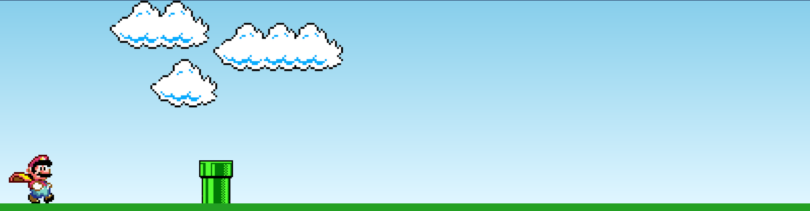
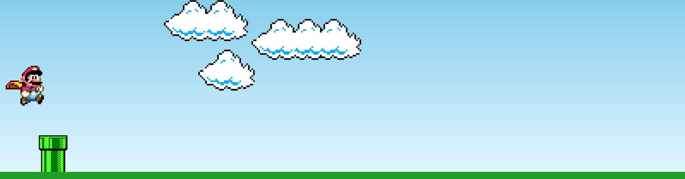
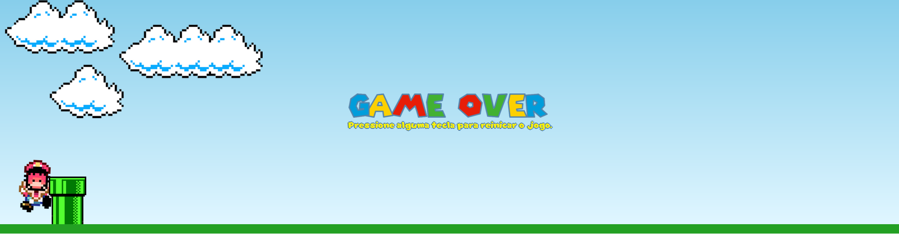

# GameMario
Mario's little game, where it was used in its construction HTML, CSS and Javascript.

## Todo
    - add blocks as obstacles in the game.
    - add function to restart the game when pressing any key at the end of the game.
    - Add a stitch marker on the upper right side of the screen.

## Screenshot
    
    
    

## Technologies
    
    
    
